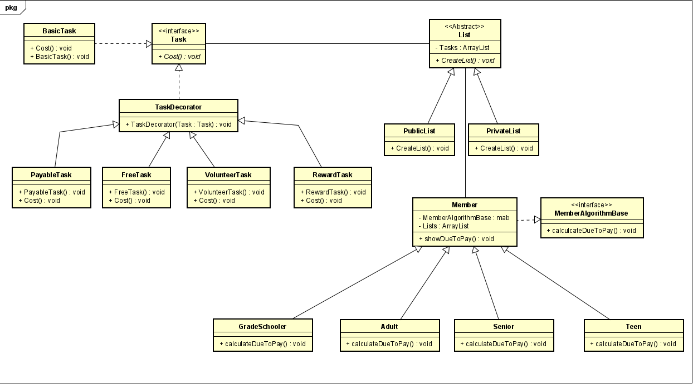

# DP-FamilyApp
An application for a family to list their synced needs and tasks whereas:

* Create lists
* Choose a task type to add to the list
* Pay what is due based on age

## Patterns used

* Decorator for adding different types of tasks
* Strategy for the payment different in regard to age
* Template for building different types of lists
# UML

